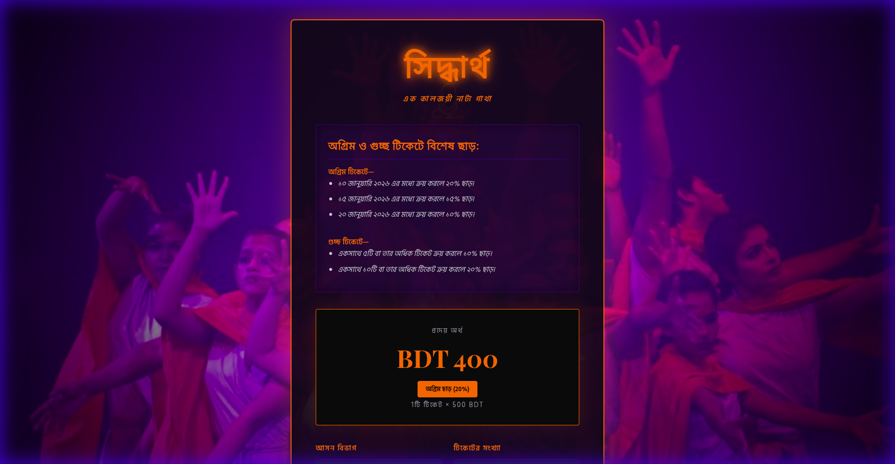
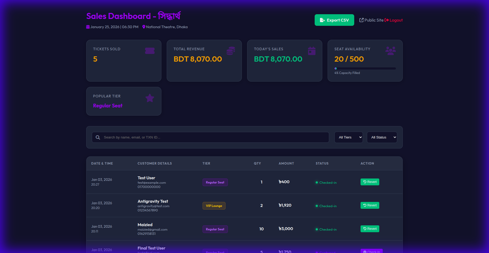

# Spotlight Tickets - Theatrical Booking System 

A premium, production-ready ticket booking system designed for theatrical performances and drama shows. This system features a rich, antique dramatic UI, secure payment integration via FlexPayBD, and a robust multi-user administrative backend.

## 🎭 Visual Showcase

### Landing Page
Theatrical design with gold accents and Bengali typography.


### Booking Success & Digital Ticket
The success page generates a working QR code (via QRServer API) for entry verification and includes a professional print-ready ticket layout.


### Admin Dashboard
Comprehensive overview of sales, revenue, and recent bookings.


### Multi-User Management
Secure session-based admin system with the ability to manage multiple administrative accounts.


## ✨ Core Features
- **Premium UI/UX**: Theatrical purple and gold theme with custom typography (Playfair Display & Hind Siliguri).
- **Dynamic Pricing**: 
    - Early Bird Discounts (Date-based).
    - Bundle Discounts (Quantity-based).
    - Promo Code support.
- **Secure Payments**: Integrated with **FlexPayBD** Hosted Payment Page.
- **Digital Tickets**: Auto-generated QR codes accessible on the success page and via email.
- **Admin Control**: Robust dashboard for sales tracking and administrative user management.
- **Persistence**: Lightweight JSON-based storage for bookings and administrative credentials.

## 🛠️ Tech Stack
- **Frontend**: Vanilla HTML5, CSS3 (Custom Theatrical Design).
- **Backend**: Native PHP 7.4+.
- **Database**: MySQL (Primary) / JSON Fallback (Dev).
- **External APIs**: 
    - **Internal Test Gateway** (Simulated Payments).
    - [QRServer](https://goqr.me/api/) (QR Generation).
    - [Google Fonts](https://fonts.google.com/).

## 🚀 Setup & Installation

### 1. Automated Deployment (Recommended)

The system uses GitHub Actions for automatic deployment. Setup once:

1. **Go to GitHub Repository Settings → Secrets and variables → Actions**
2. **Add these secrets:**
   - `FTP_SERVER`: `ftpupload.net` (your FTP host)
   - `FTP_USERNAME`: `if0_40819537` (your FTP username)
   - `FTP_PASSWORD`: Your FTP password from InfinityFree

3. **That's it!** Every push to `main` branch will automatically:
   - ✅ Create `.env` with database credentials
   - ✅ Deploy all files via FTP
   - ✅ Set proper permissions

### 2. First-Time Database Setup

After first deployment, visit **once**:
```
https://your-domain.com/setup_database.php
```

This will:
- Create all database tables
- Insert default admin account
- Set up initial event data

**Security:** Delete `setup_database.php` after running it.

### 3. Admin Access
Standard login path: `public/admin.php`
- **Default Username**: `admin`
- **Default Password**: `admin123`

## 🔒 Security Measures
- **Password Hashing**: Administrative passwords are securely hashed using `PASSWORD_DEFAULT`.
- **Session Security**: Protected admin routes with session-based authentication.
- **Data Protection**: `.gitignore` configured to prevent sensitive data (`admins.json`, etc.) from being pushed to public repositories.
- **Access Restrictions**: `.htaccess` implemented to block direct web access to JSON, SQL, and configuration files.

## 📜 License
This project is for demonstration and production use in theatrical events. All rights reserved.
